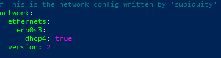
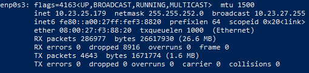

# Tolosa pelota kirol elkartea - Zerbitzaria

- [Tolosa pelota kirol elkartea - Zerbitzaria](#tolosa-pelota-kirol-elkartea---zerbitzaria)
  - [Erabilitako materiala](#erabilitako-materiala)
  - [Hardware](#hardware)
  - [Zerbitzaria nola administratu (SSH bidezko konexioa)](#zerbitzaria-nola-administratu-ssh-bidezko-konexioa)
  - [Sare konfigurazioa](#sare-konfigurazioa)
  - [Apache HTTP Server instalazioa](#apache-http-server-instalazioa)
  - [MySQL Server instalazioa](#mysql-server-instalazioa)


## Erabilitako materiala

- [Oracle VM VirtualBox](https://www.virtualbox.org/wiki/Downloads)
- [Ubuntu Server 22.04](https://ubuntu.com/download/server)
- [Apache HTTP Server](https://httpd.apache.org/download.cgi)
- [MySQL Server](https://dev.mysql.com/downloads/installer/)


## Hardware

- Disko gogorra: 50 GB
- Sistema Eragilea: Ubuntu Server 22.04
- RAM memoria: 4 GB
- CPU: 2

## Zerbitzaria nola administratu (SSH bidezko konexioa)

Zerbitzaria administratzeko, gure ordenagailutik egitea komeni da, ez zerbitzaritik. SSH konexioa erabiliz egin daiteke hori.

Jarraitu beharreko urratsak:

- Ireki Windows PowerShell aplikazioa administratzaile gisa
- Terminalean lerro hau idatzi eta pasahitza sartu:
```
ssh administrador@10.23.25.179
```


## Sare konfigurazioa

- Konfigurazioa mota: Zubias
- Sare-parametroak esleitzeko metodoa: DHCP

 




## Apache HTTP Server instalazioa

- Zerbitzariaren terminalean komando lerro hau idatzi behar da:

    ```
    apt install apache2 php php-mysql
    ```
- Proiektua githubetik klonatu
    ````
    cd /var/www
    ````
    - Klonazio agindua exekutatu

    ````
    git clone https://github.com/1ag3unaxazpi/TolosaPilotaElkartea.git
    ````

- Virtual Host-a aldatu

    ````
    nano /etc/apache2/sites-available/000-default.conf
    ````
    Hurrengo VirtualHost-a itsatsi:
    ````
    <VirtualHost *:80>
            # The ServerName directive sets the request scheme, hostname and port that
            # the server uses to identify itself. This is used when creating
            # redirection URLs. In the context of virtual hosts, the ServerName
            # specifies what hostname must appear in the request's Host: header to
            # match this virtual host. For the default virtual host (this file) this
            # value is not decisive as it is used as a last resort host regardless.
            # However, you must set it for any further virtual host explicitly.
            #ServerName www.example.com

            ServerAdmin webmaster@localhost
            DocumentRoot /var/www/html/TolosaPilotaElkartea

            # Available loglevels: trace8, ..., trace1, debug, info, notice, warn,
            # error, crit, alert, emerg.
            # It is also possible to configure the loglevel for particular
            # modules, e.g.
            #LogLevel info ssl:warn

            ErrorLog ${APACHE_LOG_DIR}/error.log
            CustomLog ${APACHE_LOG_DIR}/access.log combined

            # For most configuration files from conf-available/, which are
            # enabled or disabled at a global level, it is possible to
            # include a line for only one particular virtual host. For example the
            # following line enables the CGI configuration for this host only
            # after it has been globally disabled with "a2disconf".
            #Include conf-available/serve-cgi-bin.conf
    </VirtualHost>
    ````


## MySQL Server instalazioa

- Zerbitzariaren terminalean komando lerro hau idatzi behar da:

    ```
    apt install mysql-server
    ```

    ````
    nano /etc/mysql/mysql.conf.d/mysqld.cnf
    ````
    Hurrengoa ezarri:
    ````
    bind-address            = 0.0.0.0
    mysqlx-bind-address     = 0.0.0.0
    ````
    